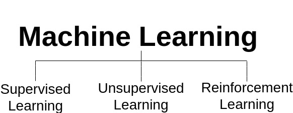
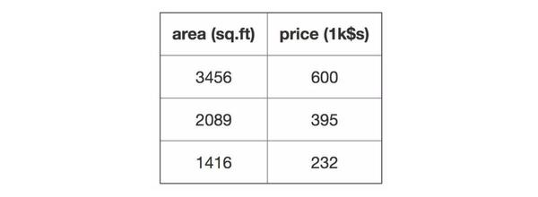
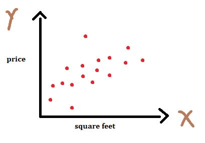
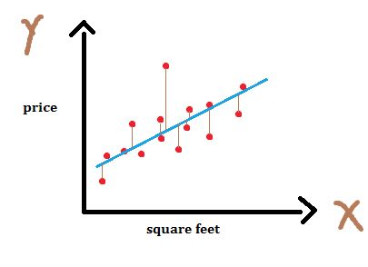
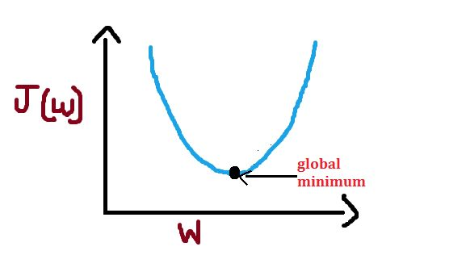
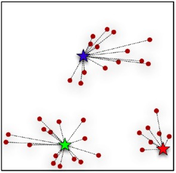
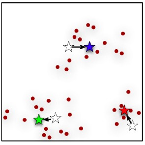

# Understanding Machine Learning

### Types of Machine Learning Algorithms
- Supervised Learning
- Unsupervised Learning
- Reinforcement Learning

### Supervised Learning
    The aim is to predict the target/outcome variable.
    - Regression
    - Classification
    Ex- Linear Regression, Logistic Regression
   
### Unsupervised Learning
    In this we do not have any target/outcome variable to predict. Mainly used for clustering popultaion in different groups.
    Ex- K-means
    
### Reinforcement Learining
    The machine is made to learn from past experiences, trained to make specific decision.
    Ex- Markov Decision Process
    

## Linear Regression
    Used When target variables are real valued
    
### Data

### Scatter

### Models
\begin{equation}
y(x^i)=\theta_1*x^i+\theta_0
\end{equation}

### Cost
\begin{equation}
J(\theta_1,\theta_0)=\frac{1}{2n}\sum_{i=1}^{n}(y(x^i)-y_{true}^i)^2
\end{equation}

### Residuals

### Optimization : Gradient Descent
\begin{equation}
\frac{\partial J}{\partial \theta_1}=\frac{1}{n}\sum_{i=1}^{n}(y(x^i)-y_{true}^i)*x^i\\
\frac{\partial J}{\partial \theta_0}=\frac{1}{n}\sum_{i=1}^{n}(y(x^i)-y_{true}^i)
\end{equation}

#### Updating Parameters :
\begin{equation}
\theta_1=\theta_1-\alpha*\frac{\partial J}{\partial \theta_1}\\
\theta_0=\theta_0-\alpha*\frac{\partial J}{\partial \theta_0}
\end{equation}

## K Means Clustering
   ### Iterative approach
   - Cluster Assignment
   - Move centroids
   
### Assign clusters to selected centroids

### Move centroid to the average of clusters

### References
- Common Lounge Machine Learning [https://www.commonlounge.com/discussion/040066e852e04889810c0e82910ad10f](https://www.commonlounge.com/discussion/040066e852e04889810c0e82910ad10f)

- AV Basics [https://www.analyticsvidhya.com/blog/2015/06/machine-learning-basics/](https://www.analyticsvidhya.com/blog/2015/06/machine-learning-basics/) 

- AV Machine Learning Algorithms [https://www.analyticsvidhya.com/blog/2017/09/common-machine-learning-algorithms/](https://www.analyticsvidhya.com/blog/2017/09/common-machine-learning-algorithms/)

- K-means Explaination [http://bigdata-madesimple.com/possibly-the-simplest-way-to-explain-k-means-algorithm/](http://bigdata-madesimple.com/possibly-the-simplest-way-to-explain-k-means-algorithm/)

### Additional Resources
- Andrew Ng Coursera [https://www.coursera.org/learn/machine-learning Andrew Ng Coursera](https://www.coursera.org/learn/machine-learning Andrew Ng Coursera)
